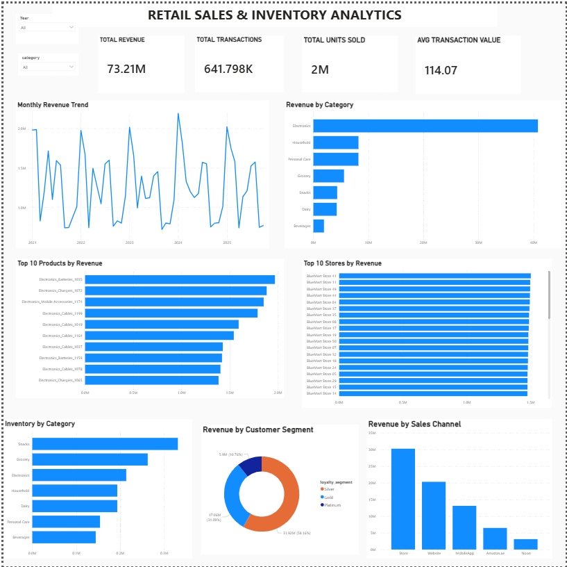

# Retail Sales & Inventory Analytics

An end-to-end retail analytics project that transforms raw transactional data into business insights using Python, MySQL, SQL, and Power BI.

The project covers the complete analytics workflow:

**Data Cleaning → Database Design → SQL Analysis → Data Modeling → Interactive Dashboard**

---

## Project Overview

The project analyzes a retail dataset containing sales transactions, customers, products, stores, promotions, and inventory.

The primary objective was to understand:

- How revenue changes over time
- Which product categories and products generate the most revenue
- Which stores and sales channels perform best
- Which customers contribute the most revenue
- How customer loyalty segments differ in spending
- Where inventory is concentrated
- Which products have slow inventory movement
- How promotions affect sales performance

The final output is an interactive Power BI dashboard supported by a MySQL analytical database and a collection of SQL business analyses.

---

## 1. Data Cleaning & Preparation

The raw data consisted of six CSV files:

| Dataset | Description |
|---|---|
| `bm_sales.csv` | Transaction-level sales records |
| `bm_customers.csv` | Customer and loyalty information |
| `bm_skus.csv` | Product/SKU details |
| `bm_stores.csv` | Store information |
| `bm_inventory.csv` | Inventory and stock information |
| `bm_promotions.csv` | Promotion details |

The raw datasets were first inspected and prepared using Python and Jupyter Notebook.

The cleaning process included:

- Inspecting dataset structure and data types
- Handling missing values
- Cleaning date fields
- Converting columns to appropriate data types
- Handling missing customer IDs
- Preparing the cleaned datasets for MySQL ingestion

The notebook used for the preprocessing stage is available in:

`data/data cleaning.ipynb`

---

## 2. MySQL Database Design

After preprocessing, the cleaned datasets were loaded into MySQL.

The database was organized into a fact-dimension structure to make analytical queries easier and more efficient.

### Fact Tables

**`fact_sales`**

Contains transaction-level information such as:

- Sale ID
- Sale date
- SKU
- Store
- Customer
- Quantity
- Total transaction value

**`fact_inventory`**

Contains inventory-related information such as:

- SKU
- Store
- Stock on hand
- Inventory-related measures

### Dimension Tables

**`dim_sku`**

Contains product information including:

- Product
- Category
- Brand
- Cost
- Selling price

**`dim_customer`**

Contains:

- Customer information
- Loyalty segment
- Customer attributes

**`dim_store`**

Contains:

- Store information
- City
- Store type
- Store attributes

**`dim_promotion`**

Contains:

- Promotion details
- Promotion validity
- Promotional information

A staging table was also used during the data loading and transformation process.

The complete database creation and loading process is available in:

`sql/01_database_setup.sql`

---

## 3. SQL Business Analysis

Once the database was created, SQL was used to answer 21 business questions across sales, products, customers, stores, channels, promotions, and inventory.

### Sales Analysis

- Overall sales KPIs
- Year-wise sales trends
- Revenue by product category
- Revenue contribution by category
- Year-over-year revenue growth
- Revenue by sales channel

### Product Analysis

- Top products by revenue
- Top products within each category
- Product-level sales performance

### Store Analysis

- Store-level revenue and sales performance
- Overall store rankings
- City-wise store rankings

### Customer Analysis

- High-value customers
- Revenue by loyalty segment
- Repeat versus one-time customer behavior
- Customer purchase frequency

### Inventory Analysis

- Inventory versus sales performance
- Months of inventory on hand
- Recent sales and inventory analysis
- Inventory movement classification
- Slow-moving inventory value
- Inventory turnover by category

### Promotion Analysis

- Promotion effectiveness
- Sales performance during promotional activity

All individual SQL analyses are available in the `sql/` directory.

---

## 4. SQL Techniques Used

The project uses a range of SQL concepts for business analysis, including:

- Joins
- Aggregations
- `CASE` expressions
- Subqueries
- Common Table Expressions (CTEs)
- Window functions
- `RANK()`
- `ROW_NUMBER()`
- `PARTITION BY`
- Conditional aggregation
- Date functions
- Temporary tables
- Percentage contribution analysis
- Ranking and segmentation

---

## 5. Power BI Data Model

The MySQL database was connected to Power BI to create the analytical model.

Relationships were established between the fact and dimension tables so that sales and inventory could be analyzed across:

- Products
- Categories
- Customers
- Loyalty segments
- Stores
- Cities
- Sales channels

The resulting data model was used as the foundation for the Power BI dashboard.

---

## 6. Power BI Dashboard

The final dashboard provides an interactive overview of retail performance.

### Key Performance Indicators

| KPI | Purpose |
|---|---|
| Total Revenue | Overall revenue generated |
| Total Transactions | Number of sales transactions |
| Total Units Sold | Quantity of products sold |
| Average Transaction Value | Average value per transaction |

### Dashboard Visuals

#### Sales Performance

- Monthly Revenue Trend
- Revenue by Category
- Revenue by Sales Channel

#### Product & Store Performance

- Top 10 Products by Revenue
- Top 10 Stores by Revenue

#### Customer Analysis

- Revenue by Customer Segment

#### Inventory Analysis

- Inventory by Category

### Interactive Filters

The dashboard includes:

- Year slicer
- Category slicer

These filters allow users to dynamically analyze the dashboard based on different years and product categories.

---

## Dashboard Preview



---

## 7. Key Results & Insights

The analysis covers:

- **641K+ sales transactions**
- **1.67M+ units sold**
- **73.2M+ total revenue**

Some of the major findings include:

- **Electronics** was the largest revenue-contributing category.
- Top-performing products and stores were identified using SQL ranking techniques.
- Revenue contribution differs across customer loyalty segments.
- Sales channels show different levels of contribution to overall revenue.
- Inventory analysis was used to classify products based on sales movement.
- Slow-moving inventory was identified to highlight potential areas for inventory optimization.
- Category-level inventory turnover provided an additional view of stock efficiency.

The SQL analyses provide the detailed calculations behind these findings, while Power BI presents them through an interactive dashboard.

---

## 8. Project Structure

```text
retail-sales-analytics/
│
├── data/
│   ├── bm_customers.csv
│   ├── bm_inventory.csv
│   ├── bm_promotions.csv
│   ├── bm_sales.csv
│   ├── bm_skus.csv
│   ├── bm_stores.csv
│   ├── data cleaning.ipynb
│   ├── cleaned datasets.png
│   └── README.md
│
├── sql/
│   ├── 01_database_setup.sql
│   ├── 02_overall_sales_kpis.sql
│   ├── 03_yearly_sales_trend.sql
│   ├── 04_revenue_by_category.sql
│   ├── 05_top_products_by_revenue.sql
│   ├── 06_store_performance.sql
│   ├── 07_store_revenue_ranking.sql
│   ├── 08_city_wise_store_ranking.sql
│   ├── 09_high_value_customers.sql
│   ├── 10_revenue_by_loyalty_segment.sql
│   ├── 11_inventory_vs_sales.sql
│   ├── 12_inventory_months_on_hand.sql
│   ├── 13_recent_sales_inventory_analysis.sql
│   ├── 14_inventory_movement_classification.sql
│   ├── 15_slow_moving_inventory_value.sql
│   ├── 16_inventory_turnover_by_category.sql
│   ├── 17_revenue_by_sales_channel.sql
│   ├── 18_year_over_year_growth.sql
│   ├── 19_top_products_by_category.sql
│   ├── 20_repeat_vs_one_time_customers.sql
│   ├── 21_promotion_effectiveness.sql
│   └── 22_final_business_kpis.sql
│
├── powerbi/
│   └── Retail_Sales_Analytics_Dashboard.pbix
│
├── screenshots/
│   └── dashboard.png
│
└── README.md

 9. Tools & Technologies

### Programming & Data Processing
- Python
- Pandas
- Jupyter Notebook

### Database & Analysis
- MySQL
- SQL

### Business Intelligence
- Power BI

### Data Modeling
- Fact-Dimension Model
- Relational Data Modeling

### Version Control
- Git
- GitHub

## 10. How to Reproduce the Project

### Step 1 — Clone the Repository

Clone the repository and navigate to the project directory:

```bash
git clone https://github.com/Loshanya/retail-sales-analytics.git
cd retail-sales-analytics
 10. How to Reproduce the Project

### Step 2 — Prepare the Data

The project uses six source datasets available in the `data/` directory:

```text
data/
├── bm_customers.csv
├── bm_inventory.csv
├── bm_promotions.csv
├── bm_sales.csv
├── bm_skus.csv
└── bm_stores.csv
The data-cleaning notebook is available at:
data/data cleaning.ipynb

The notebook was used to inspect and prepare the raw datasets before loading them into MySQL.

The cleaning process includes:

Inspecting the structure and data types
Handling missing values
Cleaning date fields
Converting columns to appropriate data types
Handling missing customer IDs
Preparing the datasets for database ingestion

### Step 3 — Create the MySQL Database

Open MySQL Workbench and execute:

sql/01_database_setup.sql

This script creates the retail_analytics database and the required staging, fact and dimension tables.

The database contains:

fact_sales
fact_inventory
dim_customer
dim_sku
dim_store
dim_promotion

The script also loads the required data and establishes the relationships between the tables.
### Step 4 — Run the SQL Analysis

After creating and populating the database, execute the remaining SQL scripts from the sql/ directory.

The SQL scripts answer individual business questions related to:

Overall sales performance
Revenue by category
Year-wise sales trends
Top products
Store performance
Customer behavior
Customer loyalty segments
Inventory performance
Sales channels
Year-over-year growth
Promotion effectiveness

The project contains 21 business analyses, with each SQL file focusing on a specific analytical problem.

### Step 5 — Open the Power BI Dashboard

Open the Power BI file:

powerbi/Retail_Sales_Analytics_Dashboard.pbix

The Power BI model uses the MySQL database tables to create relationships between sales, inventory, products, customers and stores.

The dashboard contains:

Total Revenue
Total Transactions
Total Units Sold
Average Transaction Value
Monthly Revenue Trend
Revenue by Category
Top 10 Products by Revenue
Top 10 Stores by Revenue
Revenue by Customer Segment
Revenue by Sales Channel
Inventory by Category

### Step 6 — Explore the Dashboard

The dashboard contains interactive Year and Category slicers.

Users can select a specific year or product category and dynamically analyze the corresponding changes in:

Revenue
Transactions
Units Sold
Average Transaction Value
Revenue trends
Product performance
Store performance
Customer segments
Sales channels
Inventory

This allows the dashboard to be used for both high-level business monitoring and detailed performance analysis.